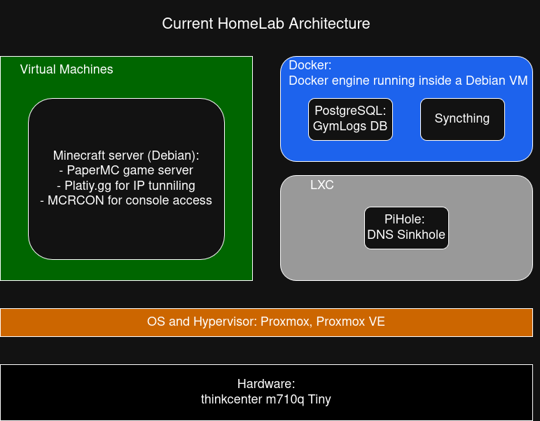

# MyHomelab

## Intro

I was first introduced to the world of homelabing when I stumbled across YouTube videos about self-hosting services locally. What started as curiosity quickly turned into a hands-on way to explore Linux, networking, and server administration. This repo documents my setup, the services I run, and the reasoning behind each decision — both as a personal reference and as a way to track my growth as a Computer Engineer.

---

## Disclaimer

MyHomelab is always a work in progress. This repo does not capture every change or experiment — I am constantly tinkering, breaking things, and improving. I am also actively working on my documentation skills, so the quality and detail of write-ups will improve over time!

---

## Goals

My main goal with this homelab is to learn by doing. The world of Linux and servers has always fascinated me, and running real services on real hardware is the best way I know to build that knowledge. More specifically, I want to:

- Get hands-on experience with Linux, virtualization, and networking
- Self-host useful services and reduce reliance on third-party platforms
- Improve my ability to document and recreate infrastructure from scratch
- Explore automation, monitoring, and DevOps tooling

---

## Current Architecture

###  Minecraft Server (Debian VM)
A PaperMC game server running inside a Debian VM. Originally designed to run 24/7 for friends, it has since shifted to an on-demand model to save resources. It uses **Platiy.gg** for IP tunneling so friends can connect without port forwarding, and **MCRCON** for remote console access and server management.

### PiHole (LXC)
Network-wide ad blocking and a recursive DNS resolver running in an LXC container. PiHole was chosen for its large community and extensive blocklist ecosystem, providing a private, self-hosted DNS path so no external provider logs browsing history.

### Syncthing (Docker)
Automatic, peer-to-peer file synchronization across devices with no third-party cloud involved. Replaces manual `scp` transfers and keeps files consistently up to date between machines.

### PostgreSQL — GymLogs DB (Docker)
A PostgreSQL database powering a personal gym logging application, running as a Docker container alongside Syncthing.

---

## Future Plans & Services I Would Like to Run

- **Reverse proxy** — expose services cleanly through a single entry point
- **Prometheus + Grafana** — system and service monitoring with dashboards
- **Ansible** — automated deployment scripts to recreate the homelab on any machine
- **Pi-Hole + Unbound** — upgrade the current Pi-Hole setup with a local recursive DNS resolver for enhanced privacy
- **Minecraft improvements** — better plugins, automated in-game messages, and proper scheduled start/stop via cron
- **Vaultwarden** — self-hosted password manager (lower priority)
